# Travel Management System 
## 

### The Travel management system is implemented using java programming language, the frames are constructed using Swings and Data base implemented using MySQL and connected by using jdbc connectivity.

## The Login Page 
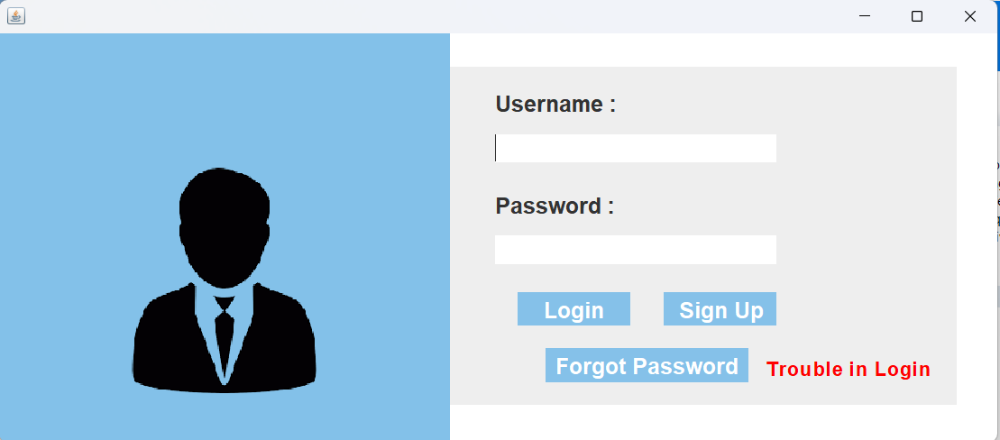

## Signup Page
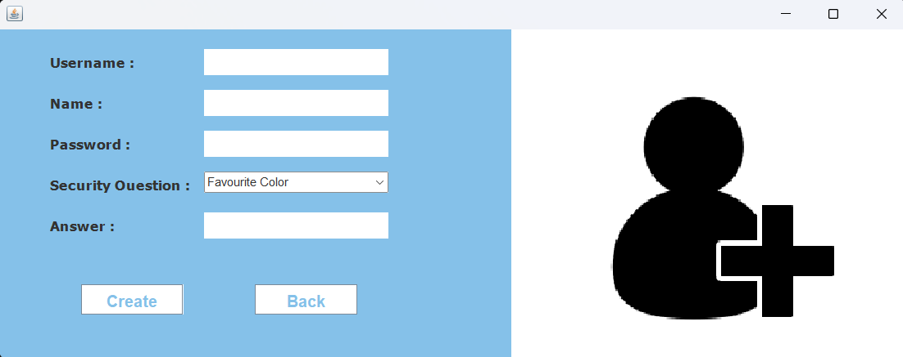

## Loading Page
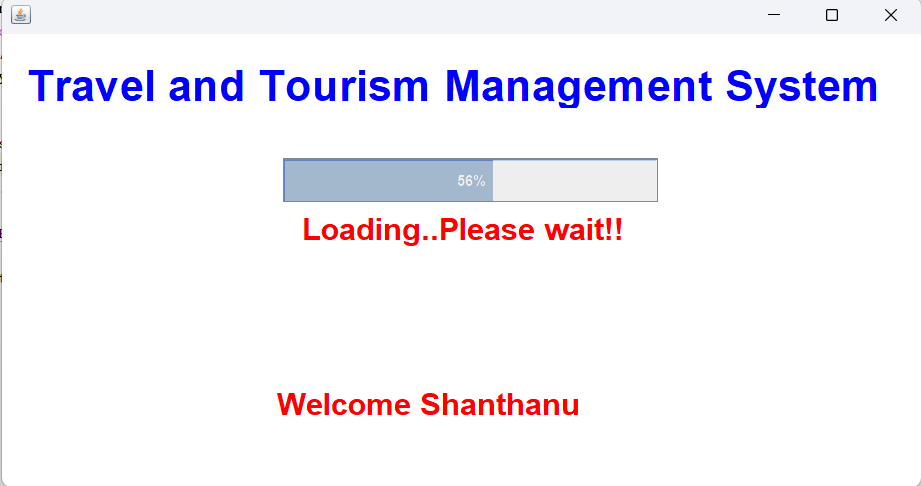

## Dashboard

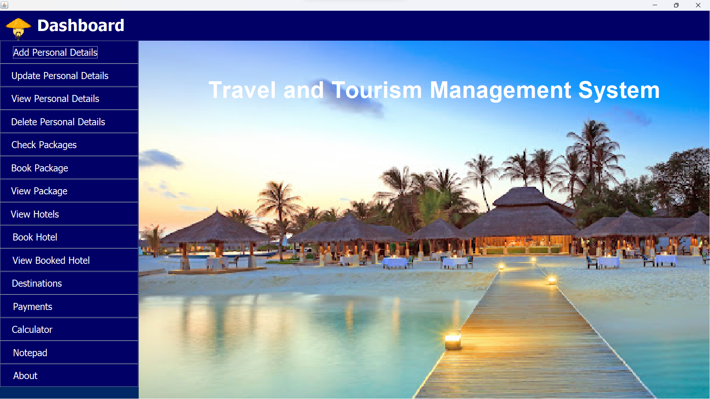
### It contains the list of operations.

## Add personal details page.
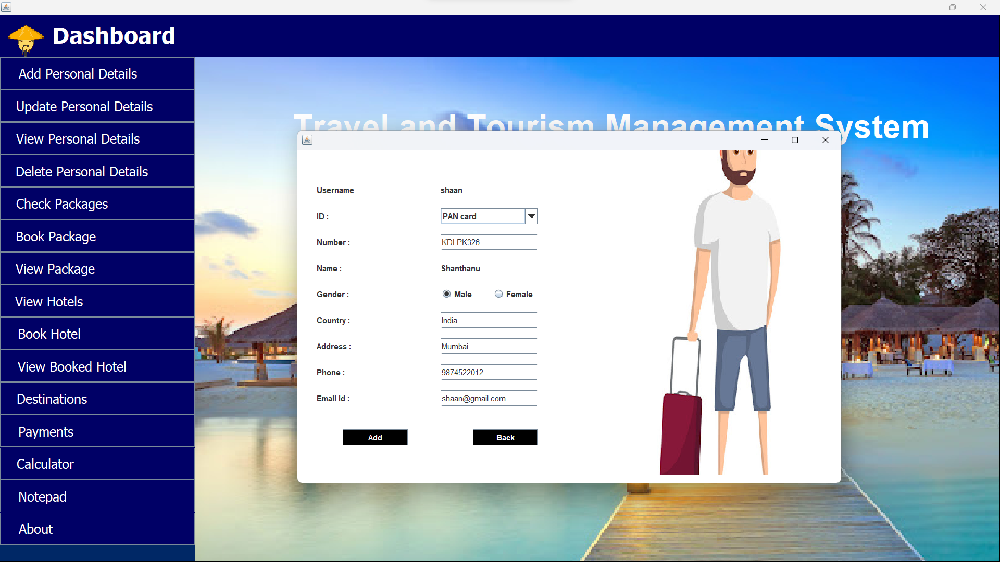

## Update personal details page.
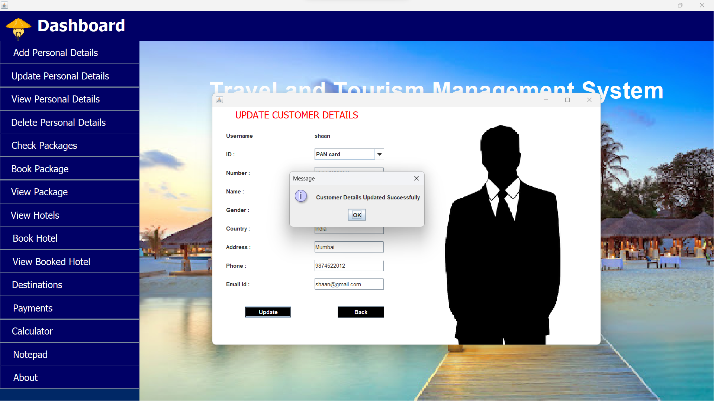

## View personal details page.

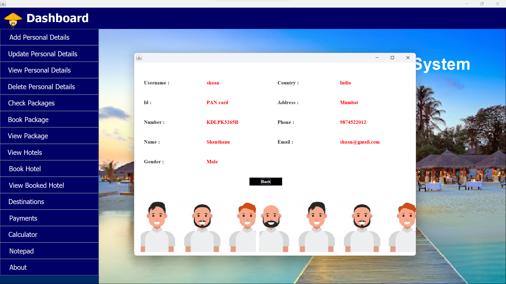

## Check package page.

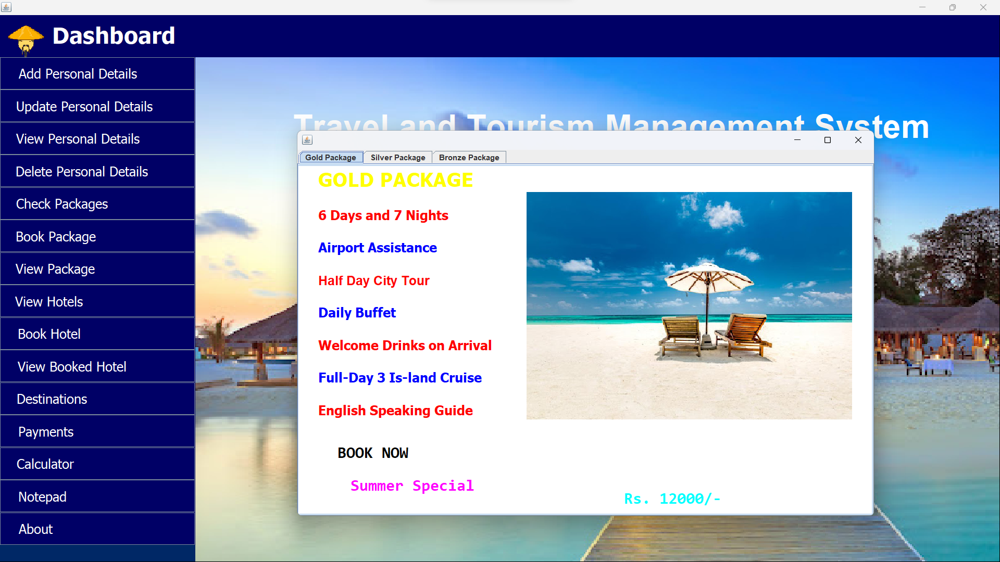

## Book package page.
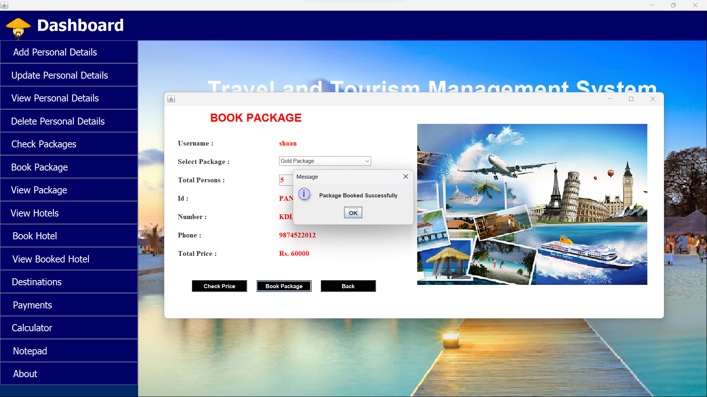

## View booked package page.

## View Hotels slideshow page
  .png>) 

## Book Hotels page

## View Booked Hotels page

## Destinations slide show page
 .png>) .png>)

## Payments page

## Paytm page
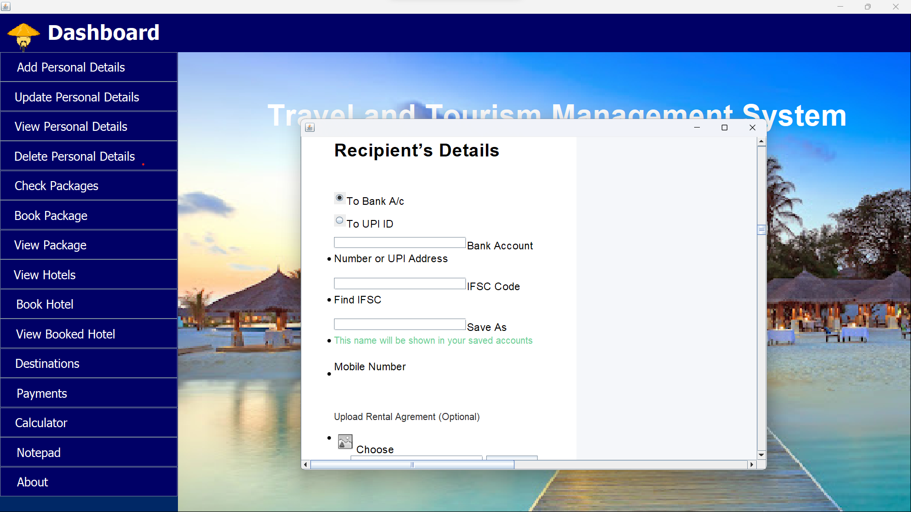

 ## Calculator page
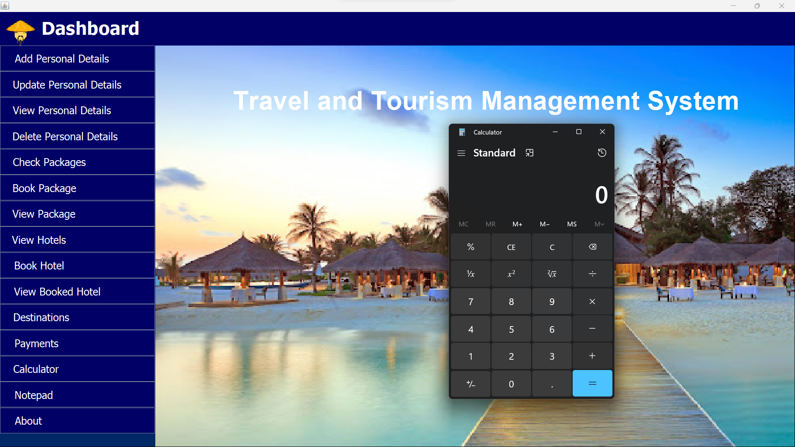

## Notepad page
 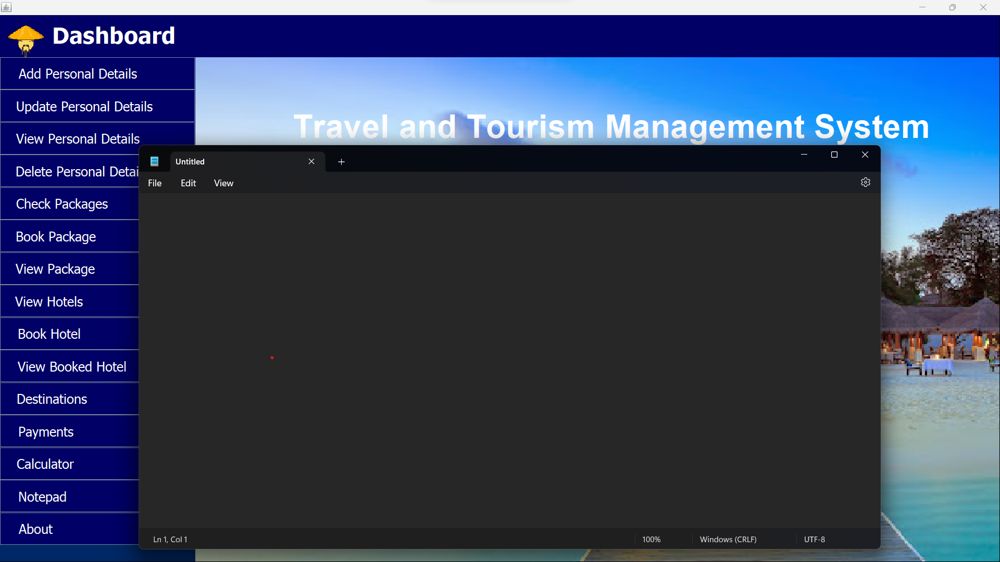

 ## About page

## Delete Personal details page

